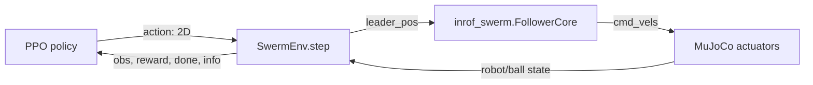

# 強化学習まわりの現状コード解説

最終更新: 2026-05-28

このメモは、現在のリポジトリにある強化学習関連コードを一から見直すための入口です。中心は `src/inrof_mujoco/src/inrof_mujoco/rl_test.py` の `SwermEnv` で、MuJoCo 上の複数ロボットと複数ボールを Gymnasium 環境として包み、Stable-Baselines3 の PPO で学習できる形にしています。

## 全体像

現在の強化学習コードは、ロボットを直接一台ずつ操作する設計ではありません。学習エージェントは 2 次元の行動を出し、その行動から「群れが追いかける仮想リーダー位置」を作ります。そのリーダー位置を `inrof_swerm` の `FollowerCore` に渡し、Boid ベースの群制御で各ロボットの速度指令に変換します。



主なファイルは次の通りです。

| ファイル | 役割 |
| --- | --- |
| `src/inrof_mujoco/src/inrof_mujoco/rl_test.py` | Gymnasium 環境 `SwermEnv` と PPO 学習関数 |
| `src/inrof_mujoco/scripts/view_rl_env.py` | `SwermEnv` を MuJoCo GUI で可視化するデバッグ用スクリプト |
| `src/inrof_mujoco/models/boid.xml` | MuJoCo モデル。5 台のロボット、3 個のボール、速度アクチュエータを定義 |
| `src/inrof_mujoco/scripts/export_model.py` | ロボット数・ボール数を指定して MuJoCo XML を生成する補助スクリプト |
| `src/inrof_swerm/src/core/boid_core.cpp` | Boid の基本速度計算。分離、整列、凝集、壁回避 |
| `src/inrof_swerm/src/core/follower_core.cpp` | Boid に仮想リーダー追従力を足して速度を計算 |
| `src/inrof_swerm/src/bindings.cpp` | C++ の `BoidCore` / `FollowerCore` などを Python から使うための pybind11 バインディング |

## 強化学習の用語との対応

| RL 用語 | このコードでの対応 |
| --- | --- |
| Environment | `SwermEnv` |
| Agent / Policy | Stable-Baselines3 の `PPO("MlpPolicy", env, ...)` |
| Observation | ロボット位置・速度、ボール位置・速度、目標位置を連結したベクトル |
| Action | `[-1, 1]` 範囲の 2 次元ベクトル |
| Reward | ボールが目標へ近づく、ロボットがボールへ近づく、ボール速度が目標方向、接近、到達などの合算 |
| Episode | `reset()` から開始し、全ボール到達または最大ステップ到達で終了 |
| Transition | `step(action)` による MuJoCo の進行と報酬計算 |

## `SwermEnv` の構造

`SwermEnv` は `gym.Env` を継承しています。初期化時に MuJoCo XML を読み込み、ロボットとボールのジョイント・速度・アクチュエータの ID をキャッシュします。

デフォルト設定は次の通りです。

| 項目 | 値 |
| --- | --- |
| ロボット数 | `robot_num=5` |
| ボール数 | `ball_num=3` |
| 最大ステップ数 | `max_steps=10000` |
| MuJoCo の内部ステップ数 | 1 環境ステップあたり `frame_skip=5` |
| MuJoCo timestep | XML 側で `0.01` 秒 |
| 1 環境ステップの物理時間 | `0.01 * 5 = 0.05` 秒 |
| 目標位置 | `[5.0, 5.0]` |
| 成功判定距離 | ボールと目標の距離が `0.25` 未満 |

### 観測

観測は 1 次元の `float32` ベクトルです。

```text
各ロボット: x, y, vx, vy
各ボール:   x, y, vx, vy
目標位置:   target_x, target_y
```

次元数は次の式です。

```text
obs_dim = robot_num * 4 + ball_num * 4 + 2
```

デフォルトでは `5 * 4 + 3 * 4 + 2 = 34` 次元です。

観測空間は `spaces.Box(low=-inf, high=inf, shape=(obs_dim,), dtype=float32)` です。つまり、現状では正規化や上限下限の明示は入っていません。

### 行動

行動空間は 2 次元です。

```python
spaces.Box(low=-1.0, high=1.0, shape=(2,), dtype=np.float32)
```

この 2 次元行動は、ロボット速度そのものではありません。`step()` 内で次のように仮想リーダー位置に変換されます。

```text
swarm_center = 全ロボット位置の平均
leader_pos = swarm_center + leader_offset_scale * action
```

`leader_offset_scale` は `2.0` なので、PPO が出した行動は「群れの中心から最大 2 m 程度ずらした仮想リーダー位置」として使われます。

### ステップ処理

`step(action)` の流れは次の通りです。

1. 行動を `[-1, 1]` にクリップする。
2. 現在のロボット位置・速度を読む。
3. ロボット群の中心を計算する。
4. 行動から仮想リーダー位置を作る。
5. `FollowerCore.update_vels()` で各ロボットの速度指令を計算する。
6. MuJoCo の速度アクチュエータ `robot_i_vx`, `robot_i_vy` に速度指令を入れる。
7. MuJoCo を `frame_skip` 回進める。
8. ロボットとボールの状態を更新する。
9. 観測、報酬、終了判定、`info` を返す。

返り値は Gymnasium の形式です。

```python
obs, reward, terminated, truncated, info
```

`terminated` は全ボールが目標に到達したときに `True` になります。`truncated` は `step_count >= max_steps` のときに `True` になります。

## 報酬設計

報酬は `_get_reward()` にまとまっています。現状の意図は「ロボット群でボールを押して、全ボールを目標位置へ運ぶ」ことです。

報酬の構成要素は次の通りです。

| 項目 | 式のイメージ | 意味 |
| --- | --- | --- |
| ボール進捗報酬 | `8.0 * (前回のボール-目標距離合計 - 今回の距離合計)` | ボールが目標に近づくと正 |
| 接近報酬 | `4.0 * (前回のロボット-ボール距離合計 - 今回の距離合計)` | ロボットがボールへ近づくと正 |
| 目標方向速度報酬 | ボール速度と目標方向の内積の正成分 | ボールが目標方向へ動くと正 |
| 接触ボーナス | `0.25 * 接近中のボール数` | 最近傍ロボット距離が `0.18` 未満のボールに加点 |
| 部分成功ボーナス | `3.0 * 新しく目標到達したボール数` | 初めて目標圏内に入ったボールへ加点 |
| 距離ペナルティ | `-0.01 * ボール-目標距離合計` | 目標から遠いほど少し減点 |
| 時間ペナルティ | `-0.01` | 長引くほど少し減点 |
| 全成功ボーナス | `+20.0` | 全ボールが目標到達したら加点 |

`info` にはデバッグ用に次の値が入ります。

| キー | 内容 |
| --- | --- |
| `ball_distance_sum` | 全ボールの目標までの距離合計 |
| `robot_ball_distance_sum` | 各ボールに最も近いロボットまでの距離合計 |
| `reached_balls` | 目標圏内に入っているボール数 |
| `success` | 全ボールが目標圏内なら `True` |

重要なのは、この報酬が「最終成功だけ」ではなく、途中の進捗をかなり強く見ていることです。これは学習を始めやすくするための shaped reward です。一方で、報酬の各項目が強すぎると、最終目的とは違う局所的な行動を覚える可能性もあります。

## MuJoCo モデル

`src/inrof_mujoco/models/boid.xml` では、平面上に 5 台の箱型ロボットと 3 個の球が置かれています。

ロボットは各自 `x` と `y` のスライドジョイントを持ち、`robot_i_vx` と `robot_i_vy` の速度アクチュエータで動きます。アクチュエータの制御範囲は `[-0.2, 0.2]` です。

ボールも `x` と `y` のスライドジョイントを持ちますが、アクチュエータはありません。ロボットとの物理接触によって動く想定です。

重力は `0 0 0` です。高さ方向の運動ではなく、2D 平面上の押し込み問題として扱っています。

`scripts/export_model.py` は XML を生成する補助スクリプトです。注意点として、このスクリプトのデフォルトは `BALL_NUM=5` ですが、現在の学習コードと XML は `ball_num=3` 前提です。再生成するときは、環境側の `robot_num` / `ball_num` と XML 内の名前 `robot_0...`, `ball_0...` が一致するようにしてください。

## `inrof_swerm` との関係

RL 環境は `inrof_swerm.FollowerCore` を使っています。これは C++ 実装を pybind11 で Python に公開したものです。

`BoidCore` は各ロボットの基本速度を次の合計で作ります。

```text
base_power =
  k_separation * separation
  + k_alignment * alignment
  + k_gravity * cohesion
  + k_wall * wall_avoidance
```

`FollowerCore` はこれに仮想リーダーへの追従力を足します。

```text
cmd_vel_i = base_power_i + k_follow * follow_power_i
```

最後に `max_vel` を超えないように速度ベクトルをクリップします。

`SwermEnv` 側では次のパラメータを使っています。

| パラメータ | 値 |
| --- | --- |
| `boid_num` | `robot_num` |
| `max_vel` | `0.2` |
| `Ir` | `100.0` |
| `Ir_min` | `0.01` |
| `k_separation` | `1.0` |
| `k_alignment` | `1.1` |
| `k_gravity` | `1.0` |
| `k_wall` | `0.0` |
| `k_follow` | `0.5` |

ROS 側の `follower_node` も同じ `FollowerCore` を使いますが、ROS では地図から距離場を作って壁回避に使い、速度指令をロボット座標系に回して `/cmd_vel` として publish します。MuJoCo RL 側では壁回避は無効で、速度指令は MuJoCo のグローバルな `x/y` 速度アクチュエータに直接入れています。

## 学習の入口

`rl_test.py` の `train()` は次のようになっています。

```python
env = SwermEnv(xml_path="models/boid.xml", robot_num=5, ball_num=3)
model = PPO("MlpPolicy", env, verbose=1, device="cpu")
model.learn(total_timesteps=50_000_000)
model.save("ppo_swerm")
```

実行時の注意点は、`xml_path="models/boid.xml"` がカレントディレクトリ相対であることです。基本的には `src/inrof_mujoco` に移動してから実行する前提です。

```bash
cd src/inrof_mujoco
uv run python -m inrof_mujoco.rl_test
```

ただし、`inrof_swerm` の C++ バインディングが Python から import できる状態である必要があります。ROS/colcon 側で `inrof_swerm` がビルド・インストールされていないと `import inrof_swerm` で止まります。

## 可視化とデバッグ

`scripts/view_rl_env.py` は、学習なしで `SwermEnv.step()` を回しながら MuJoCo GUI で挙動を見るためのスクリプトです。

```bash
cd src/inrof_mujoco
uv run python scripts/view_rl_env.py --mode fixed --action 0 1 --contacts
```

モードは次の 3 種類です。

| モード | 内容 |
| --- | --- |
| `fixed` | 指定した固定行動を出し続ける |
| `circle` | 円を描くように行動を変える |
| `random` | ランダム行動を出す |

ログには `reward`, `ball_distance_sum`, `robot_ball_distance_sum`, 接触数などが出ます。学習前に、固定行動や円運動で報酬が直感と合っているかを見るのに向いています。

## 現状の見直しポイント

強化学習を一から見直すなら、まず次の順番で確認すると迷子になりにくいです。

1. `view_rl_env.py` で物理挙動を確認する。
2. 固定行動で、ロボットがリーダーへ追従しているか確認する。
3. 接触時にボールが動くか確認する。
4. `ball_distance_sum` が減ったときに報酬が上がるか確認する。
5. 1 ボール、少数ロボットなど小さい問題にして学習が進むか確認する。
6. その後に 3 ボール・5 ロボットへ戻す。

特に見直したい点は次の通りです。

| 観点 | 現状 | 見直し案 |
| --- | --- | --- |
| 初期状態 | `reset()` は XML 初期配置に戻すだけ | ボール位置やロボット位置のランダム化を入れる |
| 観測 | 生の位置・速度をそのまま渡す | 目標相対座標や正規化を検討する |
| 行動 | 2D の仮想リーダーオフセット | リーダー位置、リーダー速度、個別ロボット指令などと比較する |
| 報酬 | shaped reward が多め | どの項目が効いているかアブレーションする |
| 学習設定 | PPO デフォルトに近い | `n_steps`, `batch_size`, `gamma`, `learning_rate` をログ付きで調整する |
| 評価 | 学習後評価が未実装 | eval 環境、動画保存、成功率集計を追加する |
| 保存 | `ppo_swerm` のみ | run 名、設定、git hash、報酬ログも保存する |

## 注意点

現状では `reset()` にランダム化がないため、同じ初期配置に強く適応した方策になる可能性があります。まず学習が通るか確認する段階では便利ですが、汎化性能を見るには不十分です。

観測空間が無限範囲で、位置や速度のスケールもそのままです。PPO は動きますが、学習を安定させるには観測正規化や相対座標化を検討した方がよいです。

報酬の `contact_bonus` は MuJoCo の実接触数ではなく、「最近傍ロボットとの距離がしきい値未満か」で決まります。物理接触ログを見たいときは `view_rl_env.py --contacts` を使います。

`target_position` は `[5.0, 5.0]` で固定です。床の見た目サイズや初期配置との関係を確認し、まずは到達しやすい近い目標で学習を試すのも有効です。

`export_model.py` で XML を再生成すると、ボール数が現在の `SwermEnv(..., ball_num=3)` とずれる可能性があります。XML 内に存在する `ball_i` と環境が読む `ball_num` は必ず一致させてください。

## まず読むなら

最初は次の順番で読むのがおすすめです。

1. `src/inrof_mujoco/scripts/view_rl_env.py`
2. `src/inrof_mujoco/src/inrof_mujoco/rl_test.py`
3. `src/inrof_swerm/src/core/follower_core.cpp`
4. `src/inrof_swerm/src/core/boid_core.cpp`
5. `src/inrof_mujoco/models/boid.xml`

`view_rl_env.py` から入ると、学習器をいったん忘れて「action を入れると環境がどう進むか」だけを観察できます。そのあと `rl_test.py` の `step()` と `_get_reward()` を読むと、強化学習の設計がかなり見えやすくなります。
