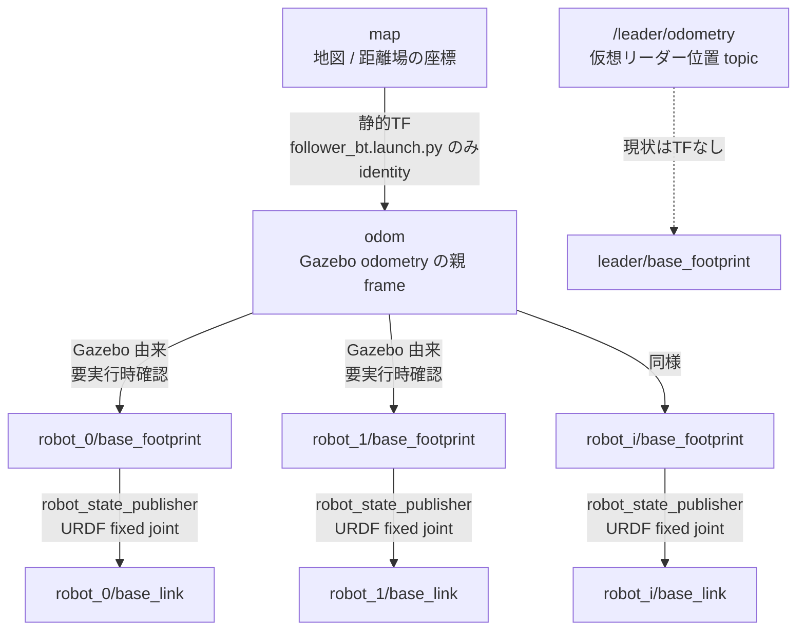

# TF / frame 設計メモ

最終更新: 2026-06-15

このメモは、このワークスペースで ROS の TF/tf2 と座標 frame がどう使われているかを整理したものです。
TensorFlow の `tf` 利用は見つかっていません。

重要な前提として、`inrof_swerm` と `inrof_control` の主要ノードは現在 `tf2::Buffer` や `lookupTransform` を使っていません。
`/robot_i/odometry` と `/leader/odometry` の位置を、そのまま同じ座標系の値として扱っています。
そのため、TF ツリーと Odometry の `header.frame_id` がずれてもコード内では検出されません。

## 期待するフレーム関係

シミュレーションで成立してほしい関係は次の形です。
実線は TF、破線は topic として流れているだけで TF にはまだ接続されていない情報です。



各ロボットについて、読みたい親子関係は次です。

```text
map
└── odom
    └── robot_i/base_footprint
        └── robot_i/base_link
```

ただし、現在この関係がコード上で完全に保証されているわけではありません。
特に `odom -> robot_i/base_footprint` と `/robot_i/odometry.child_frame_id` は実行時確認が必要です。

## 各フレームの役割

| frame / topic | 役割 | 現状 |
| --- | --- | --- |
| `map` | `nav2_map_server` が出す地図の座標。距離場もこの座標を前提に作られる。 | `follower_bt.launch.py` と `follower_rl.launch.py` で map server を起動する。 |
| `odom` | Gazebo の odometry の親 frame として使いたい座標。 | `robot.urdf` の `OdometryPublisher` で `odom_frame=odom` を指定している。 |
| `robot_i/base_footprint` | 各ロボットの2D基準 frame。 | `robot_state_publisher` 側は `frame_prefix=robot_i/` でこの名前を使う想定。Gazebo 側の child frame は未確認。 |
| `robot_i/base_link` | URDF 上の本体 frame。 | `robot_i/base_footprint -> robot_i/base_link` は fixed joint。 |
| `/robot_i/odometry` | 各ロボット位置・速度の topic。 | `follower_node`, `boid_node`, `sheep_node`, `leader_rl.py` が座標変換せず使う。 |
| `/leader/odometry` | 仮想リーダー位置の topic。 | `leader_pos_server.cpp` または `leader_rl.py` が publish する。現状は TF frame としては配信していない。 |
| `leader/base_footprint` | TF 上でリーダーを参照するなら使いたい frame。 | `leader.urdf` には定義があるが、既存 launch から起動されている箇所は見当たらない。 |

## フレーム関係を出している箇所

| 関係 / topic | 出力元 | 対象ファイル | 注意点 |
| --- | --- | --- | --- |
| `map -> odom` | `tf2_ros/static_transform_publisher` | `src/inrof_core/launch/follower_bt.launch.py` | identity の静的TF。BT版のみ。AMCL や SLAM が同じ TF を出す構成では競合する。 |
| `odom -> robot_i/base_footprint` | Gazebo pose または odometry 由来の TF として期待 | `src/inrof_core/launch/sim.launch.py`, `src/inrof_core/launch/rl_sim.launch.py`, `src/inrof_sim/urdf/robot.urdf` | `robot.urdf` は `robot_base_frame` を明示していないため、child frame 名が `robot_i/base_footprint` になる保証を確認する必要がある。 |
| `robot_i/base_footprint -> robot_i/base_link` | `robot_state_publisher` | `src/inrof_core/launch/sim.launch.py`, `src/inrof_core/launch/rl_sim.launch.py`, `src/inrof_sim/urdf/robot.urdf` | `frame_prefix=robot_i/` により URDF の `base_footprint` と `base_link` に prefix が付く。 |
| `/robot_i/odometry` | `ros_gz_bridge` で `/model/<robot>/odometry` を bridge | `src/inrof_core/launch/sim.launch.py`, `src/inrof_core/launch/rl_sim.launch.py` | `header.frame_id` と `child_frame_id` が TF ツリーと一致しているか確認する。 |
| `/leader/odometry` | 仮想リーダー制御ノード | `src/inrof_control/src/leader_pos_server.cpp`, `src/inrof_control/src/inrof_control/leader_rl.py` | TF は配信していない。BT経由では frame_id が空になり得る。RL版も header を設定していない。 |
| `leader/base_footprint -> leader/base_link` | `leader.urdf` の fixed joint | `src/inrof_sim/urdf/leader.urdf` | URDF にはあるが、既存 launch では使われていないように見える。 |

## launch ごとの見え方

| launch | 主な役割 | TF / frame の観点 |
| --- | --- | --- |
| `src/inrof_core/launch/sim.launch.py` | IRC table world で `robot_0` から `robot_4` を spawn する。 | `robot_state_publisher` と Gazebo bridge を起動する。`map -> odom` は出さない。 |
| `src/inrof_core/launch/rl_sim.launch.py` | plane world で `robot_0` から `robot_4` を spawn する。 | `sim.launch.py` と同じ構造。`map -> odom` は出さない。 |
| `src/inrof_core/launch/follower_bt.launch.py` | map server, follower, BT, leader position server を起動する。 | `map -> odom` の identity 静的TFを出す。 |
| `src/inrof_core/launch/follower_rl.launch.py` | map server, follower, BT, RL leader server を起動する。 | map server は起動するが、`map -> odom` は出さない。map 由来の距離場と odometry を混ぜるなら注意が必要。 |

## 制御コード側の前提

現在の制御コードは、Odometry の数値をそのまま共通座標の値として使っています。

| ファイル | 座標系に関する挙動 |
| --- | --- |
| `src/inrof_swerm/src/ros/follower_node.cpp` | `/map`, `/robot_i/odometry`, `/leader/odometry` を使う。距離場は map 由来だが、ロボットとリーダー位置は Odometry を変換せず使う。 |
| `src/inrof_swerm/src/ros/boid_node.cpp` | `/robot_i/odometry` の pose/twist をそのまま Boid 計算に使う。 |
| `src/inrof_swerm/src/ros/sheep_node.cpp` | `/robot_i/odometry` と `/leader/odometry` を同じ座標系として扱う。 |
| `src/inrof_control/src/path_generate_server.cpp` | `start_pos.header.frame_id` を `Path.header.frame_id` にコピーする。`goal_pos` や `waypoints` の frame 一致は確認しない。 |
| `src/inrof_control/src/leader_pos_server.cpp` | path の各 pose を `/leader/odometry` として publish する。TF は出さない。 |
| `src/inrof_control/src/inrof_control/leader_rl.py` | `/robot_i/odometry` を観測として使い、`/leader/odometry` を publish する。header は設定していない。 |

この前提で安全に動かすには、少なくとも次のどちらかを満たす必要があります。

1. `map` と `odom` を同一座標として扱い、`map -> odom` の identity TF を常に出す。
2. 制御計算の入力を tf2 で明示的に `map` または `odom` へ変換してから使う。

## 怪しい点

### `robot.urdf` の base frame が明示されていない

`src/inrof_sim/urdf/robot.urdf` の `OdometryPublisher` plugin は `odom_frame` だけを指定しています。
複数ロボットを spawn する構成では、Odometry/TF の child frame が `robot_i/base_footprint` になる保証を確認した方がよいです。
`leader.urdf` のように `robot_base_frame` を明示する方が安全です。

### Gazebo bridge と `robot_state_publisher` の frame がつながるか未確認

`sim.launch.py` と `rl_sim.launch.py` は Gazebo の `/model/<robot>/pose` を `/tf` に bridge しています。
一方、`robot_state_publisher` は `frame_prefix=robot_i/` により `robot_i/base_footprint -> robot_i/base_link` を出します。
bridge 側の child frame が `robot_i/base_footprint` と一致しない場合、TF ツリーが分断されます。

### `map -> odom` が launch によって違う

`follower_bt.launch.py` は `map -> odom` を出しますが、`follower_rl.launch.py` は出していません。
どちらの follower も map server と Odometry を同時に使うため、map 座標と odom 座標をどう一致させるかを launch 間でそろえる必要があります。

### `PoseStamped` と `Odometry` の frame_id が空になり得る

`src/inrof_bt/src/bt/leader_pos_bt.cpp` は `LeaderPos` goal の `start_pos` と `goal_pos` に `header.frame_id` を設定していません。
そのため `src/inrof_control/src/path_generate_server.cpp` が生成する `nav_msgs/Path` や、`leader_pos_server.cpp` が publish する `/leader/odometry` の frame が空になる可能性があります。
`leader_rl.py` が publish する `/leader/odometry` も header を設定していません。

### `inrof_core` の実行時依存が不足している

`follower_bt.launch.py`, `sim.launch.py`, `rl_sim.launch.py` は `tf2_ros`, `robot_state_publisher`, `ros_gz_bridge`, `ros_gz_sim` などを起動します。
しかし `src/inrof_core/package.xml` にはこれらの `exec_depend` がありません。
launch を提供するのは `inrof_core` なので、実行時依存も `inrof_core` に宣言するのが妥当です。

## 修正優先度

### 1. frame_id を空にしない

最初に直すべきです。

- `src/inrof_bt/src/bt/leader_pos_bt.cpp`: `start_pos.header.frame_id` と `goal_pos.header.frame_id` を設定する。BT の入力ポートに `frame_id` を追加するか、当面は `map` などの固定値を入れる。
- `src/inrof_control/src/inrof_control/leader_rl.py`: `/leader/odometry.header.frame_id` を `map` または `odom` に設定する。
- `/leader/odometry.child_frame_id` を使うなら `leader/base_footprint` にそろえる。

### 2. ロボットの base frame を明示する

`src/inrof_sim/urdf/robot.urdf` の `OdometryPublisher` plugin に、各ロボット名に対応した `robot_base_frame` を渡せる形にするのが安全です。
現在の `robot.urdf` は全ロボットで同じ文字列を使うため、xacro 引数などで `robot_i/base_footprint` を渡す設計が必要です。

### 3. `map` と `odom` の扱いを launch 間でそろえる

map 由来の距離場と Gazebo odometry を同一座標として扱うなら、BT版とRL版で同じように `map -> odom` を出すべきです。
実機や自己位置推定を入れるなら、`map -> odom` は localization 側に任せ、静的TFは出さない方がよいです。

### 4. tf2 で入力座標を検証または変換する

優先度が高い順です。

| ノード/ファイル | やること |
| --- | --- |
| `src/inrof_swerm/src/ros/follower_node.cpp` | map 由来の距離場、ロボット Odometry、リーダー Odometry を同じ planning frame にそろえる。最低でも frame 不一致を warning/error にする。 |
| `src/inrof_control/src/path_generate_server.cpp` | `start_pos`, `goal_pos`, `waypoints` の frame が空または不一致なら reject する。可能なら `planning_frame` へ tf2 変換してから経路生成する。 |
| `src/inrof_swerm/src/ros/boid_node.cpp` | 複数ロボットの pose/twist を共通 frame にそろえてから Boid 計算に入れる。 |
| `src/inrof_swerm/src/ros/sheep_node.cpp` | ロボット群とリーダー位置を共通 frame にそろえる。 |
| `src/inrof_control/src/leader_pos_server.cpp` | TF でリーダーを参照したいなら、`map` または `odom` から `leader/base_footprint` への `TransformBroadcaster` を追加する。 |

## 実行時の確認コマンド

launch 後に、まず TF ツリー全体を確認します。

```bash
ros2 run tf2_tools view_frames
```

特定の関係は次で確認します。

```bash
ros2 run tf2_ros tf2_echo odom robot_0/base_footprint
ros2 run tf2_ros tf2_echo map robot_0/base_footprint
```

Odometry の frame も確認します。

```bash
ros2 topic echo /robot_0/odometry --once
ros2 topic echo /leader/odometry --once
ros2 topic echo /tf --once
```

見るポイントは次です。

- `/robot_0/odometry.header.frame_id` が `odom` または設計した共通 frame になっているか。
- `/robot_0/odometry.child_frame_id` が `robot_0/base_footprint` になっているか。
- `/tf` に `odom -> robot_0/base_footprint` が出ているか。
- `/tf` に `robot_0/base_footprint -> robot_0/base_link` が出ているか。
- `/leader/odometry.header.frame_id` が空ではないか。
- `view_frames` で `map`, `odom`, `robot_i/base_footprint`, `robot_i/base_link` が1本の木につながっているか。
